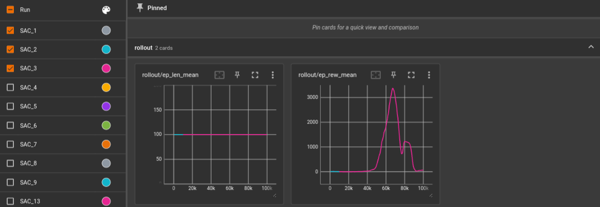
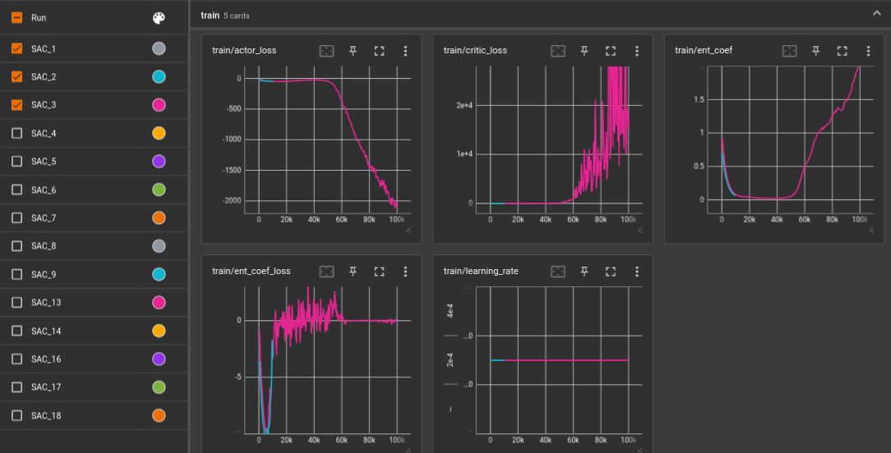
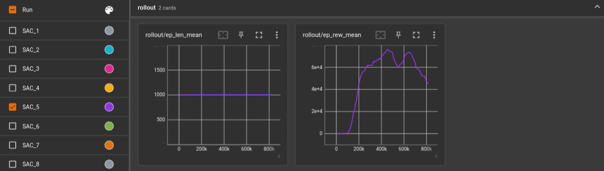
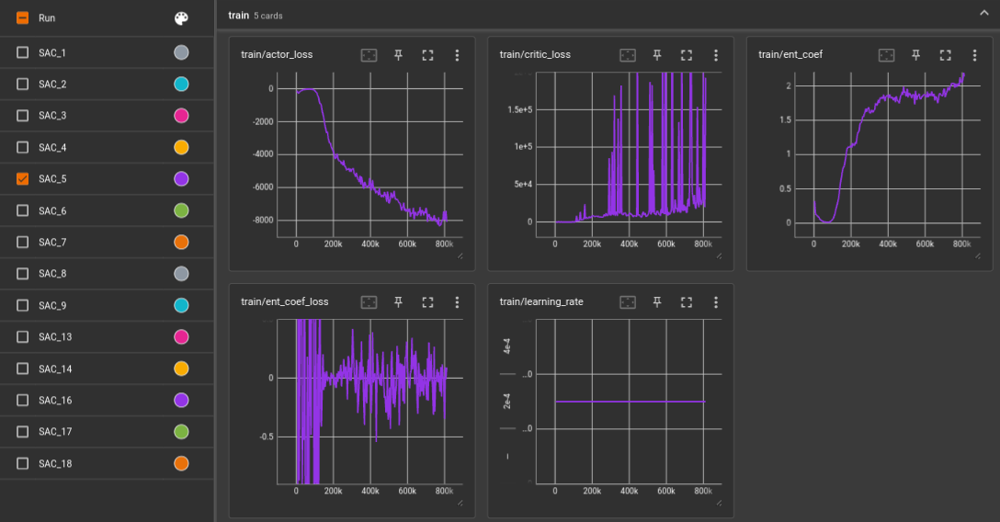
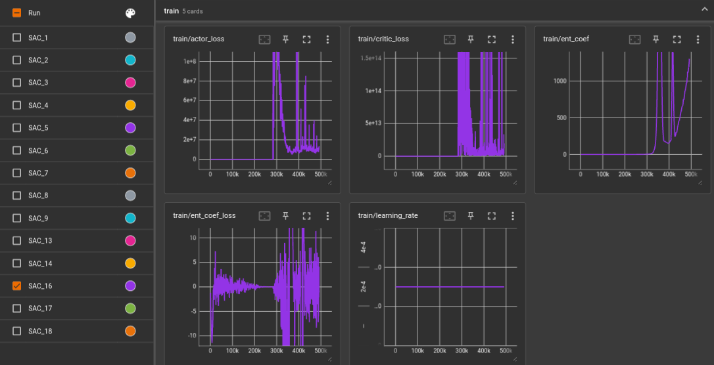
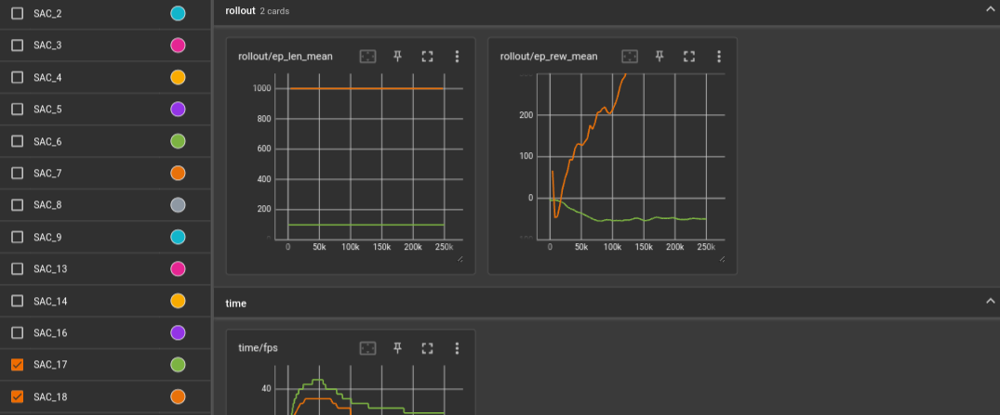
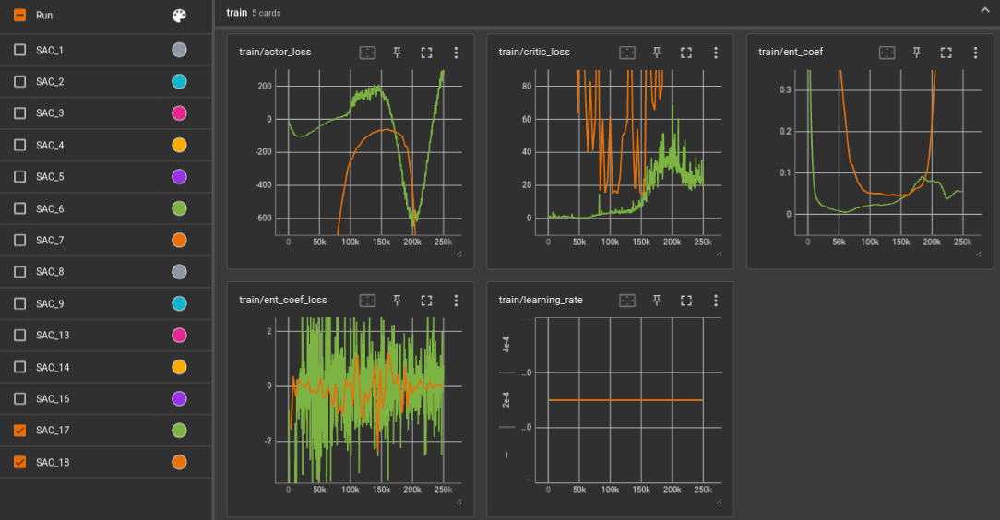
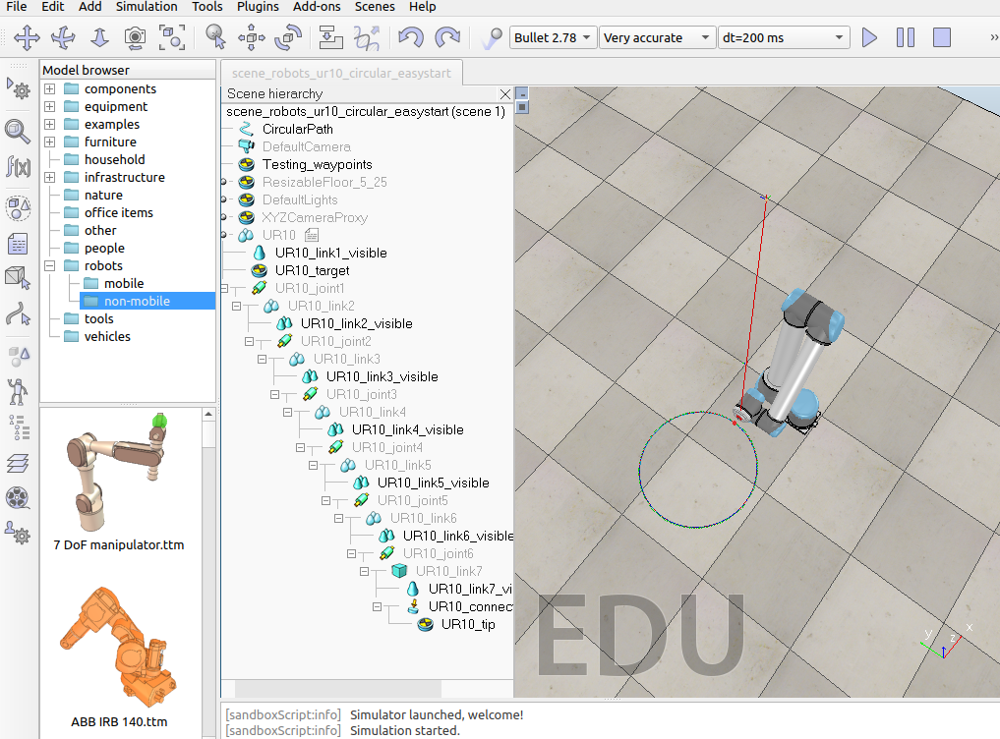
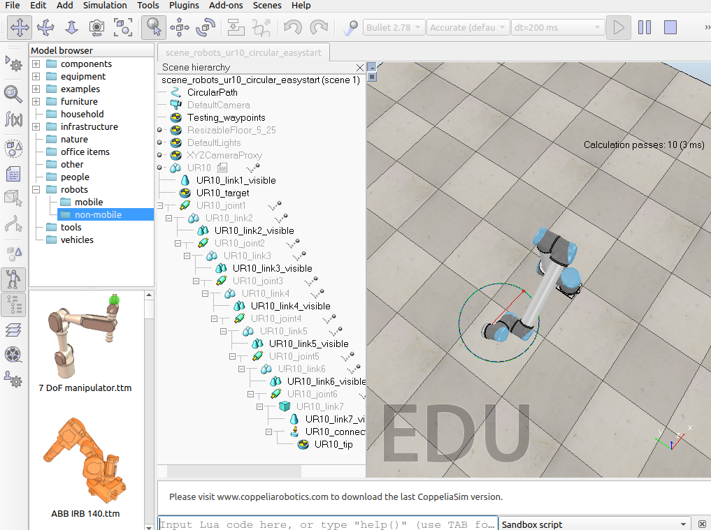
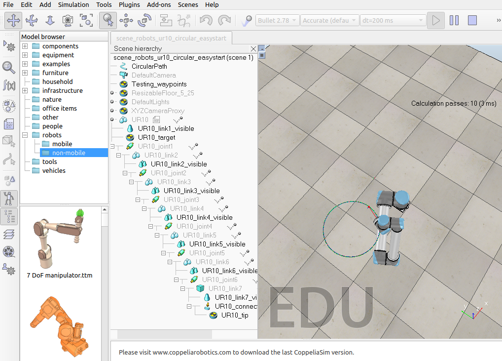

# ai-ur10

Project Title: AI-UR10 Shoe Personalization

# Overview

This project aims to utilize the UR10 robot to personalize shoes by observing the object in space, segmenting it, creating a 3D model, and adding customized tags based on the model. The following steps outline the process to achieve this goal:

# Steps

1. Observing the object in space

The UR10 robot is employed in this step to record a video of the shoe from various perspectives in a 3D environment. For later steps, the video footage will be an essential source of information. Make sure the robot is calibrated correctly and able to move around the object to gather complete visual data.

Here is the joint position for his initial position:
Base:       -90.00°
Shoulder:   -50.00°
Elbow:      -160.00°
Wrist 1:    30.00°
Wrist 2:    90.00°
Wrist 3:    0.00°

We initially intended to move in a circle around the object, but encountered issues such as: 
- Impact issues because the UR10 was touching the object of interest 
- Singularity points that forced the UR10 to move in a way that prevented him from making a second semi-circular movement to return to his starting position.

As a result, we try a different strategy by moving semi-circularly above the robot. This method is easier because the outgoing and return movements are identical. However, we see very tiny variations between outbound and return movement, which, depending on the location of the item of interest, leads to somewhat superior tracking for either the outbound or return travel. In order to ensure that we had enough information to continue with the project's second phase, we decided to only catch the object during its outward motion. 

To perform the movements we use the URScript. However, in order to anticipate more complex movements later in the project, we try to train our robot arm through Reinforcement Learning (RL), using a combination of the simulator CoppeliaSim, OpenAI Gym package to create a RL environment, and Stable Baselines 3 package and their SAC algorithm. This setup allow us to have a fast simulated RL environment to train our arm in. The movement we try to perform is the circle on a flat plane parallel to the floor mentionned earlier with the tip of the arm. In our latest version, the arm must learn to orient its tip toward the center of the circle at all time.

RL developement was an iterative process for us. Here are some examples of training curves and what we introduced each time.

* SAC_1	: not enough training time, thought it was not working
* SAC_2	: more training time, still not working but actor loss is decreasing
* SAC_3	: even more training time, at the end it kinda works !

We see that our agent is learning something at some point, its reward went up, the actor loss went down. And the resulting movement was encouraging. 

* SAC_4	: even even more training time, as it seems it could learn more. We go too far in the training :D
* SAC_5   : slow down the circular motion, giving it more time to adjust, but requires a lot more traning !

* SAC_6   : elevate circle in the air and closer to robot, orient the robot to have easier first movements, allocate steps to reach first position, quick circular motion.
* SAC_7   : from now on, observe the difference between the target orientation and tip orientation
* SAC_8   : readjusting the weights in the reward of each component, move the circle closer to the robot. The observed behavior of the robot is that it folds but in the wrong way, making it harder to move later on 
* SAC_9   : reward is harder now as regard the distance BONUS_THRESHOLD = 0.1 BONUS_REWARD = 1 VELOCITY_PENALTY = 0.01 ORIENTATION_PENALTY = 0.01
* SAC_13  : the trainings in-between are mistakes. I just push the training further hoping the entropy will help the arm start folding the right way. 
* SAC_14  : add another 10M steps => it's bad.
* SAC_16  : simplifying the task again by giving a better start position with correct flex, reset the target position

* SAC_17  : sets an overall time, only change the target when the arm is close, reduce circle to 25 points
* SAC_18  : re instaure the high bonus, 1000 steps episode

Unfortunately, we are not yet able to perform a proper circular movement learned with RL. At best the arm reaches the location of the circle and vaguely goes around it. We found it hard to determine what were the steps to make it work, but there is an extensive documentation about RL and room for improvement.

Some illustrations of what you can see when using the RL setup to try out a learned movement, the arm is trying to reach the red dot on the circle :

There is still much to do on this part, succeed to do that simple movement, and then go toward more complex ones that would be used to draw with the arm on a shoe.

2. Segment the object

After the video has been recorded, the process of distinguishing the shoe item from the background begins. This segmentation process aims to identify specific shoe parts that can be changed. To precisely isolate the shoe item, use segmentation techniques like "Segment Anything."

So, after filming the subject of interest, we attempt to cut the movie into separate parts using Segment Anything. To do this, we employ the library'metaseg' which already has a function that takes a video as an argument and returns a segmented video. Unfortunately, if your GPU has less than 5GB, we can't use this model. We use a second computer to create the segmentation because we don't have this resource on a single laptop.

In terms of how long it takes to segment the video, we presummated previously that splitting the movie in half affects the segmentation process. In essence, by recording the outward and return movements, we were able to capture a film of about 18 seconds, which took about 18 minutes to segment. By solely recording the outward motion, we were able to get an 8-second video that took 8 minutes to segment.

3. Use 3D modeling (not implemented yet)

The goal is to construct a 3D model of the shoe once the object has been correctly segmented. The 3D model will give a thorough picture of the shoe's physical design and act as a guide for accurate modification. Create the 3D model from the segmented video footage using the relevant software libraries, such as OpenCV or Meshroom.

4. Customizable areas (not implemented yet)

The UR10 robot can be given instructions on where to apply customized tags on the shoe using a marker based on the 3D model created in the previous stage. The exact placements, orientations, and dimensions of the tags will be determined with the help of the 3D model. To ensure precise and consistent customisation, make sure the robot and marker tool are effectively communicating with one another.

# Installation

You need to install IP Webcam (https://play.google.com/store/apps/details?id=com.pas.webcam&hl=en_IN&pli=1) on your smartphone and activate the setting 'This is a public camera' in 'Local broadcasting' settings. Then 'Start server' by clicking on the three dots on top-right of the application.

To use Segment Anything you need to Microsoft Visual C++ greather than 14 version.

Before testing our project, meet all the requirements in requirements.txt

In order to use the Segment Anything, you will need a certain amount of GPU. Minimum requirements: **5 GB**
